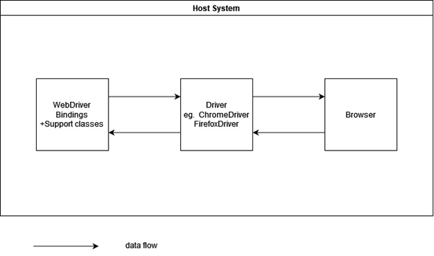
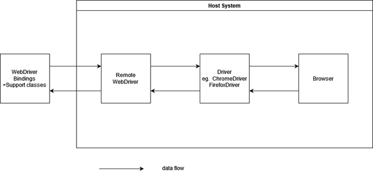
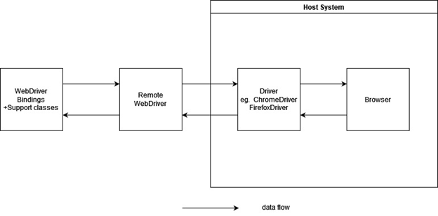
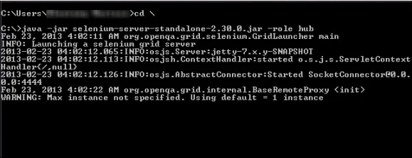
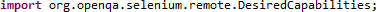
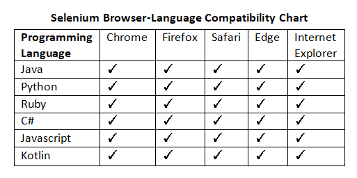

<!-- START: HEADER -->
<div align="center">
<div align="center">
  
  
  </div>
  <h1>Selenium</h1>
  <h3>The Selenium Browser Automation Project</h3>
  
  **Version 4.12**
  
  **Contributors**

2021326660029 - Alba, Nelson Jr.

2021326660024 - Lauron, John Albert

2021326660023 - Plongkaew, Chaiwat

2021326660027 - Akaaboune, Sifeddine

Instructor and Lecturer - 梁鹏老师 Peng Liang Laoshi

**2023 May 17**

<!-- END: HEADER -->

---

<!-- START: ABSTRACT -->
<h1>Abstract</h1>  

<p>This research paper is all about analysing the Software Architecture of the famous open-source project called Selenium. Also known as "The Selenium Browser Automation Project", this open-source project is an umbrella project that creates a wide set of tools, libraries, and extensions for browser automations and tests catering to different environments, domains, and platforms. This research paper would focus on the architecture of one of its known tools - the Selenium WebDriver. </p>


<p> <b>Acknowledgments:</b> We would like to thank Peng Liang Laoshi for giving us consistent and useful feedback and guidance in the process of formulating and in completion of this Software Architecture document for the Selenium Project.</p>
</div>
 <!-- END: ABSTRACT -->

---

<!-- START: REVISION LOG -->
  <h1>Revision Log</h1>  

<details open align="left">
  <summary><b>Revision Log</b></summary>

<div align="center">

|**#**|**Version**|**Date**|**Logs**|
| :-: | :-: | :-: | :-: |
|1|1\.1|3/1/23|<p>- [Description](https://github.com/WHUSENG21/WHUSENG21-Y2S2-SA#1---introduction),</p><p>- [Business Context](https://github.com/WHUSENG21/WHUSENG21-Y2S2-SA#1---introduction),</p><p>- [Key Quality Concerns](https://github.com/WHUSENG21/WHUSENG21-Y2S2-SA#1---introduction)</p>|
|2|2\.2|3/8/23|<p>- [Description](https://github.com/WHUSENG21/WHUSENG21-Y2S2-SA#1---introduction),</p><p>- [Business Context](https://github.com/WHUSENG21/WHUSENG21-Y2S2-SA#1---introduction),</p><p>- [Key Quality Concerns](https://github.com/WHUSENG21/WHUSENG21-Y2S2-SA#1---introduction)</p>|
|3|2\.3|3/15/23|- [Stakeholder](https://github.com/WHUSENG21/WHUSENG21-Y2S2-SA#2---stakeholder-analysis)[s ](https://github.com/WHUSENG21/WHUSENG21-Y2S2-SA#2---stakeholder-analysis)[Analysis](https://github.com/WHUSENG21/WHUSENG21-Y2S2-SA#2---stakeholder-analysis)|
|4|2\.4|3/22/23|- [Stakeholders Analysis](https://github.com/WHUSENG21/WHUSENG21-Y2S2-SA#2---stakeholder-analysis)|
|5|2\.5|3/29/23|<p>- [Stakeholders Analysis](https://github.com/WHUSENG21/WHUSENG21-Y2S2-SA#2---stakeholder-analysis)</p><p>- [Viewpoints Analysis](https://github.com/WHUSENG21/WHUSENG21-Y2S2-SA#3---viewpoints-analysis)</p>|
|6|3\.6|4/5/23|<p>- [Stakeholders Analysis](https://github.com/WHUSENG21/WHUSENG21-Y2S2-SA#2---stakeholder-analysis),</p><p>- [Viewpoints Analysis](https://github.com/WHUSENG21/WHUSENG21-Y2S2-SA#3---viewpoints-analysis),</p><p>- [Perspectives](https://github.com/WHUSENG21/WHUSENG21-Y2S2-SA#4---perspectives-analysis)[ Analysis](https://github.com/WHUSENG21/WHUSENG21-Y2S2-SA#4---perspectives-analysis)</p>|
|7|3\.7|4/12/23|<p>- [Stakeholders Analysis](https://github.com/WHUSENG21/WHUSENG21-Y2S2-SA#2---stakeholder-analysis),</p><p>- [Viewpoints Analysis](https://github.com/WHUSENG21/WHUSENG21-Y2S2-SA#3---viewpoints-analysis),</p><p>- [Perspectives](https://github.com/WHUSENG21/WHUSENG21-Y2S2-SA#4---perspectives-analysis)[ Analysis](https://github.com/WHUSENG21/WHUSENG21-Y2S2-SA#4---perspectives-analysis)</p>|
|8|3\.8|4/19/23|<p>- [Stakeholders Analysis](https://github.com/WHUSENG21/WHUSENG21-Y2S2-SA#2---stakeholder-analysis),</p><p>- [Viewpoints Analysis](https://github.com/WHUSENG21/WHUSENG21-Y2S2-SA#3---viewpoints-analysis),</p><p>- [Perspectives](https://github.com/WHUSENG21/WHUSENG21-Y2S2-SA#4---perspectives-analysis)[ Analysis](https://github.com/WHUSENG21/WHUSENG21-Y2S2-SA#4---perspectives-analysis)</p>|
|9|3\.9|4/26/23|<p>- [Introduction (File Organisation)](https://github.com/WHUSENG21/WHUSENG21-Y2S2-SA#1---introduction),</p><p>- [Stakeholders Analysis](https://github.com/WHUSENG21/WHUSENG21-Y2S2-SA#2---stakeholder-analysis),</p><p>- [Viewpoints Analysis](https://github.com/WHUSENG21/WHUSENG21-Y2S2-SA#3---viewpoints-analysis),</p><p>- [Perspectives](https://github.com/WHUSENG21/WHUSENG21-Y2S2-SA#4---perspectives-analysis)[ Analysis](https://github.com/WHUSENG21/WHUSENG21-Y2S2-SA#4---perspectives-analysis),</p><p>- [Technical Debt](https://github.com/WHUSENG21/WHUSENG21-Y2S2-SA#5---technical-debt)</p>|
|10|4\.10|5/3/23|<p>- [Stakeholders Analysis](https://github.com/WHUSENG21/WHUSENG21-Y2S2-SA#2---stakeholder-analysis),</p><p>- [Viewpoints Analysis](https://github.com/WHUSENG21/WHUSENG21-Y2S2-SA#3---viewpoints-analysis),</p><p>- [Perspectives](https://github.com/WHUSENG21/WHUSENG21-Y2S2-SA#4---perspectives-analysis)[ Analysis](https://github.com/WHUSENG21/WHUSENG21-Y2S2-SA#4---perspectives-analysis)</p>|
|11|4\.11|5/10/23|<p>- [Introduction](https://github.com/WHUSENG21/WHUSENG21-Y2S2-SA#1---introduction),</p><p>- [Stakeholders Analysis](https://github.com/WHUSENG21/WHUSENG21-Y2S2-SA#2---stakeholder-analysis),</p><p>- [Viewpoints Analysis](https://github.com/WHUSENG21/WHUSENG21-Y2S2-SA#3---viewpoints-analysis),</p><p>- [Perspectives](https://github.com/WHUSENG21/WHUSENG21-Y2S2-SA#4---perspectives-analysis)[ Analysis](https://github.com/WHUSENG21/WHUSENG21-Y2S2-SA#4---perspectives-analysis),</p><p>- [Conclusion](https://github.com/WHUSENG21/WHUSENG21-Y2S2-SA#5---conclusion)</p>|
|12|4\.12|5/17/23|<p>- [Introduction](https://github.com/WHUSENG21/WHUSENG21-Y2S2-SA#1---introduction),</p><p>- [Stakeholders Analysis](https://github.com/WHUSENG21/WHUSENG21-Y2S2-SA#2---stakeholder-analysis),</p><p>- [Viewpoints Analysis](https://github.com/WHUSENG21/WHUSENG21-Y2S2-SA#3---viewpoints-analysis),</p><p>- [Perspectives](https://github.com/WHUSENG21/WHUSENG21-Y2S2-SA#4---perspectives-analysis)[ Analysis](https://github.com/WHUSENG21/WHUSENG21-Y2S2-SA#4---perspectives-analysis),</p><p>- [Conclusion](https://github.com/WHUSENG21/WHUSENG21-Y2S2-SA#5---conclusion)</p>|

</div>
</div>
<!-- END: REVISION LOG -->

---

<!-- START: TABLE OF CONTENTS -->

# Table of Contents

<details open align="left">
  <summary><b>Table of Contents</b></summary>

- [Table of Contents](#table-of-contents)
- [**List of Tables and Figures**](#list-of-tables-and-figures)
  - [**List of Tables**](#list-of-tables)
  - [**List of Figures**](#list-of-figures)
- [**1 - Introduction**](#1---introduction)
  - [**1.1 - Description**](#11---description)
  - [**1.2 - File Organisation**](#12---file-organisation)
- [**2 - Stakeholder Analysis**](#2---stakeholder-analysis)
  - [**2.1 - Stakeholders by Category**](#21---stakeholders-by-category)
    - [**2.1.1 - Acquirers**](#211---acquirers)
    - [**2.1.2 - Assessors**](#212---assessors)
    - [**2.1.3 - Communicators**](#213---communicators)
    - [**2.1.4 - Developers**](#214---developers)
    - [**2.1.5 - Maintainers**](#215---maintainers)
    - [**2.1.6 - Production Engineers**](#216---production-engineers)
    - [**2.1.7 - Suppliers**](#217---suppliers)
    - [**2.1.8 - Support Staff**](#218---support-staff)
    - [**2.1.9 - System Administrators**](#219---system-administrators)
    - [**2.1.10 - Testers**](#2110---testers)
    - [**2.1.11 - Users**](#2111---users)
    - [**2.1.12 - Competitors**](#2112---competitors)
  - [**2.2 - Stakeholder Influence**](#22---stakeholder-influence)
  - [**2.3 - Requirements Analysis**](#23---requirements-analysis)
    - [**2.3.1 - Functional Requirements**](#231---functional-requirements)
    - [**2.3.2 - Key Quality Attributes (Non-Functional Requirements)**](#232---key-quality-attributes-non-functional-requirements)
- [**3 - Viewpoints Analysis**](#3---viewpoints-analysis)
  - [**3.1 - Context View**](#31---context-view)
    - [**3.1.1 - System Scope**](#311---system-scope)
    - [**3.1.2 - External Entities Involved**](#312---external-entities-involved)
    - [**3.1.3 - Context View Model**](#313---context-view-model)
  - [**3.2 - Functional View**](#32---functional-view)
    - [**3.2.1 - Capabilities**](#321---capabilities)
    - [**3.2.2 - Interfaces and Structure**](#322---interfaces-and-structure)
  - [**3.3 - Development View**](#33---development-view)
    - [**3.3.1 - Module Structure**](#331---module-structure)
      - [**Major Architectural Components**](#major-architectural-components)
      - [**Source Code Structure**](#source-code-structure)
    - [**3.3.2 - Codeline Model**](#332---codeline-model)
      - [**Common Design**](#common-design)
        - [**Focus on the User**](#focus-on-the-user)
        - [**Use a “Best Fit” Language**](#use-a-best-fit-language)
        - [**Layered Design**](#layered-design)
      - [**Reducing Cost of Change**](#reducing-cost-of-change)
      - [**Release Process**](#release-process)
    - [**3.3.3 - Design Patterns and Development Strategies**](#333---design-patterns-and-development-strategies)
- [**4 - Perspectives Analysis**](#4---perspectives-analysis)
  - [**4.1 - Performance and Scalability Perspective**](#41---performance-and-scalability-perspective)
  - [**4.2 - Reusability Perspective**](#42---reusability-perspective)
  - [**4.3 - Compatibility Perspective**](#43---compatibility-perspective)
  - [**4.4 - Simplicity Perspective**](#44---simplicity-perspective)
- [**5 - Conclusion**](#5---conclusion)
- [**References**](#references)


</details>
<!-- END: TABLE OF CONTENTS -->

---

# <a name="_u9gkeum5l1z3"></a>**List of Tables and Figures**

<details open align="left">
  <summary><b>List of Tables and Figures</b></summary>

## <a name="_sid7rvw4kzp3"></a>**List of Tables**


|**#**|**Section**|**Name**|**Description**|
| :-: | :-: | :-: | :-: |
|1|1\.1|Table 1.1.1|…|
|||||

## <a name="_6fuyov8qmsd"></a>**List of Figures**


|**#**|**Section**|**Name**|**Description**|
| :-: | :-: | :-: | :-: |
|1|2\.2|Figure 2.2.1|Selenium Stakeholder Analysis: Power-Interest Grid.|
|||||

</details>

---

<!-- START: MAIN CONTENT -->
# <a name="_808k3p6uwfld"></a>**1 - Introduction**
## <a name="_6l1061z4lx79"></a>**1.1 - Description**
Selenium is an open-source project that allows automated testing of web applications across various browsers and platforms. It provides a suite of tools for automating web browsers, including a browser automation framework, a WebDriver API, and a language-specific client library. With Selenium, developers and testers can write scripts to simulate user interactions with a website, such as clicking buttons, filling out forms, and navigating through pages. Selenium supports multiple programming languages, including Java, Python, and JavaScript, making it easy to integrate with existing testing frameworks. It is widely used in the industry for testing web applications, ensuring they work as expected across different browsers and operating systems. Additionally, Selenium is highly extensible, enabling developers to create custom plugins and integrations to extend its capabilities.

The Selenium Project is formed by a community of users and open source contributors who develop, use and promote the different Selenium projects (IDE, Grid, WebDriver) and other related things, with the end goal of benefiting the community as a whole. The Selenium Project wants as much as possible to operate using procedures that are fair, open, inviting, and ultimately good for the community. Selenium is primarily used for but not limited to automated testing of web applications. It helps developers and testers quickly identify and fix issues with applications, ensuring that they work as expected across different browsers (Firefox, Microsoft Edge, Chrome, etc) and platforms.

Their key quality concerns are:

1. Test Stability: Selenium tests must be reliable and consistent, producing the same results each time they are run.
1. Test Coverage: Selenium tests should cover all essential features and functionalities of the application under test.
1. Test Maintainability: Selenium tests should be easy to maintain, update, and modify when the application changes.
1. Test Performance: Selenium tests must be efficient and not overly burden the system, as this can cause false test results.
1. Test Scalability: Selenium tests should be able to handle a large number of test cases and execute them quickly.
## <a name="_k8oww71h3jnr"></a>**1.2 - File Organisation**
This document is organised in the following manner:

1. "Chapter 2: Stakeholder Analysis" focuses on looking outward in terms of the usage of the system by having an explicit stakeholder analysis based on available online documentations, as well as the activity on their open-source Github repository.
1. "Chapter 3: Viewpoints Analysis" discusses the context, functional, development viewpoints of Selenium by analysing the context in which Selenium operates, the architectural elements of Selenium that delivers its functions at runtime, as well as outlining the module structure, codeline standards, and common design models of Selenium’s Web Driver.
1. Chapter 4: Perspectives Analysis" shows an analysis on other aspects that concerns the system to further talk about Selenium's architecture, such as performance, scalability, and usability perspectives.


# <a name="_ay7rt7jg0ozs"></a>**2 - Stakeholder Analysis**
In this chapter, we will analyse how Selenium WebDriver's architecture can work with its stakeholders by creating an architecture that would meet their complex, overlapping, and sometimes, needs and concerns that conflict with each other.
## <a name="_wg0c2dp1jl2l"></a>**2.1 - Stakeholders by Category**
We classify stakeholders based on Rozanski and Woods according to their roles and concerns.
### <a name="_ivlnfvn7f8dm"></a>**2.1.1 - Acquirers**
*Oversee the procurement of the system or product*

This category includes software development firms, testing service providers, or enterprises that use Selenium for their testing needs. Acquirers are interested in evaluating the features, functionalities, and compatibility of Selenium with their existing systems and processes. They may also be involved in negotiating licensing agreements and pricing models for using the Selenium project.

1. Software development firms such as Microsoft or Google
1. Testing service providers such as Sauce Labs or BrowserStack
1. Enterprises that use Selenium for their testing needs, such as Amazon or Netflix
### <a name="_1d9ravnzixdn"></a>**2.1.2 - Assessors**
*Oversee the system’s conformance to standards and legal regulation*

This category of stakeholders is responsible for ensuring that the Selenium project adheres to industry standards, regulations, and legal requirements. Assessors may include standards bodies, compliance auditors, and legal regulators. They are interested in evaluating the quality, safety, and security of the Selenium project and may require compliance documentation, such as test reports or certification records.

1. Standards bodies such as the World Wide Web Consortium (W3C)
### <a name="_k3epg56bn6ue"></a>**2.1.3 - Communicators**
*Explain the system to other stakeholders via its documentation and training materials*

Technical writers, trainers, and instructional designers fall under this category. They are responsible for developing the documentation and training materials required to explain Selenium's features and functionalities to other stakeholders. Communicators work closely with the development team to understand the technical details of Selenium and translate them into user-friendly language. They may also conduct training sessions or webinars to educate users on how to use Selenium.

1. Technical writers such as those working for the Selenium documentation team
1. Instructional designers such as those creating Selenium training courses
1. Trainers such as those conducting Selenium webinars or workshops
### <a name="_8wlpr1qvjm5i"></a>**2.1.4 - Developers**
*Construct and deploy the system from specifications (or lead the teams that do this)*


Software engineers and developers who work on designing, coding, and deploying Selenium's framework, libraries, and APIs fall under this category. They are responsible for building and maintaining the Selenium project and contributing to the development of Selenium-based testing tools and plugins. Developers work closely with other stakeholders to understand their requirements and ensure that Selenium is compatible with different operating systems and web browsers.

1. The Selenium project's core development team, including Simon Stewart, Julian Harty, and Jim Evans
1. Open source contributors who contribute code, bug fixes, and enhancements to Selenium
1. Third-party developers who create Selenium-based testing tools or plugins, such as the Selenium IDE or Selenium Grid
### <a name="_w7tnvr9qfqsw"></a>**2.1.5 - Maintainers**
*Manage the evolution of the system once it is operational*

This category of stakeholders is responsible for managing the evolution of the Selenium project once it is operational. Maintainers may include software engineers, testers, or project managers. They are responsible for fixing bugs, adding new features, improving performance, and ensuring that Selenium remains compatible with other software and technologies. Maintainers work closely with developers to ensure that any changes or updates to Selenium are implemented smoothly.

1. Members of the Selenium project's core development team who maintain the codebase, fix bugs, and add new features
1. Community members who maintain Selenium-based testing tools or plugins
1. Project managers who oversee the maintenance of the Selenium project
### <a name="_e31z4pyqdy74"></a>**2.1.6 - Production Engineers**
*Design, deploy, and manage the hardware and software environments in which the system will be built, tested, and run*

Engineers who design, deploy, and manage the hardware and software environments in which Selenium is built, tested, and run fall under this category. This may include managing servers, databases, and cloud-based platforms. Production engineers work closely with developers and maintainers to ensure that Selenium is deployed in a secure and scalable environment.

1. Infrastructure engineers at cloud service providers such as Amazon Web Services (AWS) or Google Cloud Platform (GCP)
1. DevOps engineers who manage the deployment and scaling of the Selenium project
1. Database administrators who ensure that the Selenium project's data is secure and available
### <a name="_olh4n1h0aspy"></a>**2.1.7 - Suppliers**
*Build and/or supply the hardware, software, or infrastructure on which the system will run*

This category includes companies that build or supply the hardware, software, or infrastructure required to run Selenium. Suppliers may include hosting providers, cloud service providers, and tool vendors. They work closely with other stakeholders to ensure that their products and services are compatible with Selenium.

1. Hardware suppliers such as Dell or HP
1. Cloud service providers such as Amazon Web Services (AWS) or Google Cloud Platform (GCP)
1. Tool vendors such as JetBrains or Atlassian
### <a name="_fingaphg58xx"></a>**2.1.8 - Support Staff**
*Provide support to users for the product or system when it is running*

Support staff provides technical support and troubleshooting to users who encounter issues while using Selenium. This category includes customer support representatives, technical support engineers, and helpdesk personnel. They work closely with users to resolve any issues and may escalate more complex problems to developers or maintainers.

1. Technical support engineers at testing service providers such as Sauce Labs or BrowserStack
1. Customer support representatives at software development firms such as Microsoft or Google
1. Helpdesk personnel at enterprises that use Selenium for their testing needs
### <a name="_eaz9zn33w1yd"></a>**2.1.9 - System Administrators**
*Run the system once it has been deployed*

This category of stakeholders is responsible for running and managing the Selenium system once it has been deployed. This includes installing updates, monitoring performance, and ensuring system availability. System administrators work closely with production engineers and maintainers to ensure that Selenium is running smoothly and that any issues are resolved quickly.

1. System administrators at cloud service providers such as AWS or GCP
1. IT administrators at enterprises that use Selenium for their testing needs
1. DevOps engineers who manage the deployment and scaling of Selenium-based testing environments
### <a name="_v3n5iqq9a1d3"></a>**2.1.10 - Testers**
*Test the system to ensure that it is suitable for use*

Testers are individuals or teams who test the Selenium project to ensure that it is suitable for use, that it meets user requirements, and that it is compatible with different operating systems and web browsers. This category includes software testers, quality assurance engineers, and testing service providers. Testers work closely with developers and maintainers to identify and report any bugs or issues that they encounter during testing.

1. Software testers at software development firms such as Microsoft or Google
1. Quality assurance engineers at enterprises that use Selenium for their testing needs
1. Testing service providers such as Sauce Labs or BrowserStack
### <a name="_mzn44sii1odv"></a>**2.1.11 - Users**
*Define the system’s functionality and ultimately make use of it*


Users of Selenium are individuals or teams who define the system's functionality and ultimately make use of it. This category includes software developers, quality assurance teams, and automation engineers who use Selenium to test web applications. Users are interested in evaluating the features, functionalities, and compatibility of Selenium with their existing software development processes. They may also provide feedback on usability, performance, and other aspects of Selenium that are important to their testing needs.

1. Software developers who use Selenium to test web applications
1. Automation engineers who use Selenium to create automated test scripts
1. Quality assurance teams who use Selenium to ensure software quality and functionality
### <a name="_cfexezvshvss"></a>**2.1.12 - Competitors**
*Aim to put a similar or better competing system on the market.*

Competitors of Selenium are individuals or teams who aim to put a similar or better competing system to Selenium on the market. These stakeholders aim to develop a better system themselves to gain a competitive advantage over Selenium in the same automated testing tools market.

Stakeholders which are categorised as competitors to Selenium include:

1. testRigor
1. Rapise
1. Katalon Platform
1. Virtuoso
1. Subject7
1. Testim
1. etc.

## <a name="_cvynv9xkd1i3"></a>**2.2 - Stakeholder Influence**
Another way to classify the stakeholders of Selenium is to classify them by the power or influence they have to be able to change the system and by their interest in the Selenium Project.

<div align="center">


**Figure 2.2.1** - Selenium Stakeholder Analysis: Power-Interest Grid

</div>

The power interest grid for Selenium in the image provided shows the relative power and interest of different stakeholders in the use of the Selenium automation testing tool. The horizontal axis represents the level of power that each stakeholder has, while the vertical axis represents their level of interest in the use of Selenium.

1. **High power and high interest**: 
   *Acquirers, Users, System Administrators, Developers*

These stakeholders have a high power and high interest in the Selenium project, and their needs and expectations must be carefully considered and addressed in order to ensure the success and adoption of the project. By engaging with these stakeholders effectively, the Selenium project can continue to evolve and improve to meet the needs of its users and stakeholders. 

1. **High power and low interest**: 
   *Assessors, Production Engineers*
   While Assessors and Production Engineers may have a lower interest in the Selenium project compared to other stakeholders, their power and influence are still significant. Assessors provide valuable feedback and insights into the quality and compliance aspects of the project, while Production Engineers ensure that the project is deployed and maintained effectively. 

1. **Low power and high interest:** 

*Support Staff, Communicators, Maintainers, Suppliers*
Support staff have a high interest in ensuring that the project is reliable, efficient, and user-friendly, as this can reduce the volume of support requests and improve user satisfaction. Communicators ensure that the project is well-positioned, well-branded, and well-communicated to its target audience. Maintainers are interested in making sure that the project is secure, scalable, and reliable, as this can reduce the frequency and impact of maintenance and downtime. Suppliers have a high interest in ensuring that the project is compatible with their systems and workflows, and that it meets their specific needs and requirements. Overall, while these stakeholders may not have a high level of power to influence the Selenium project's direction, their interest and engagement can still be significant. 

1. **Low power and low interest:** 
   *Testers, Competitors*
   Testers have a high interest in ensuring that the project is reliable, efficient, and easy to use, however, their engagement may be limited to their day-to-day testing tasks. As for Competitors, they may monitor the Selenium project's development and performance, but their engagement may be limited to their own competitive strategies. Even though these stakeholders may not have a high level of power or interest in the Selenium project, their engagement can still be important. Testers can provide valuable feedback to the project's developers and maintainers, which can help to improve the project's quality and usability. Competitors can provide insight into the competitive landscape and market trends, which can help the Selenium project to stay relevant and competitive.

## <a name="_wrt87hq0ve7y"></a>**2.3 - Requirements Analysis**
### <a name="_2xeceav7w6pj"></a>**2.3.1 - Functional Requirements**

1. **Actions and Assertions:** Should provide the ability to check for element in interactions and validations
1. **Automated Testing:** Automating test sequence without manual interactions**

1. **Test Case Management:** Provide the user with a way to manage test cases and test case reports.**

1. **Headless Browser Support:** The project should support headless browsers, which allow users to run tests without a visible browser window, and enable for a faster and more efficient testing.

### <a name="_xfkt8sdcui13"></a>**2.3.2 - Key Quality Attributes (Non-Functional Requirements)**
*The Selenium WebDriver standard attempts to follow a number of design goals:*

1. **Compatibility:** Selenium is an established, long-running project used by many people. Because of its longevity and widespread use, there are many expectations about its capabilities and features. This specification is designed based on those expectations. Any enhancements or clarifications aim to meet users' needs while avoiding unintended disruptions for existing Selenium users.

   Using SMART Template for Compatibility:
- **S - Stimulus**: A user writes a Selenium test script that interacts with a specific web browser.
- **S - Stimulus source**: The user or an automated testing framework.
- **R - Response**: Selenium must be able to interact with the web browser's native APIs and functionality, and perform the requested actions.
- **R - Response measure:** The response can be measured by the accuracy and completeness of the actions performed by Selenium, as well as the reliability and stability of the results across different web browsers and operating systems.
- **E - Environment:** The environment includes the web browser, operating system, and programming language used to run the Selenium test.
- **A - Artifact:** The artifact is the Selenium test script, which must be compatible with the web browser, operating system, and programming language in the environment.

Using the SMART template, compatibility is achieved when Selenium is able to interact with the native APIs and functionality of the web browser, and perform the requested actions accurately and reliably. Compatibility can be measured by the ability of Selenium to work with a wide range of web browsers and operating systems, as well as the number of programming languages that have language bindings for Selenium. 

Selenium's compatibility is important because it enables the project to be used effectively in a wide range of environments and workflows.

1. **Simplicity:** The primary intended audience for this specification are software developers and testers who write automated tests or other automated tools, like monitoring or load testing systems, that automate web browsers.

   To support these users, care has been taken to provide features and commands that simplify common automated testing tasks, such as:
   1. Typing text into web page elements
   1. Clicking/interacting with elements on web pages
1. **Interoperability:** Selenium defines a means for others to extend the Webdriver protocol in order to automate features beyond what can be achieved with ECMAScript alone. This enables other web standards and specifications to facilitate automating new capabilities. It also permits vendors to expose functionality unique to their browser. This is accomplished in a consistent, interoperable manner and enables progression while preserving backward compatibility. New automation functionality can also be added without breaking existing implementations or workflows.
# <a name="_jcqqyrvo59ny"></a>**3 - Viewpoints Analysis**
## <a name="_cuod1pivvdii"></a>**3.1 - Context View**
### <a name="_l7fzhubhqq1a"></a>**3.1.1 - System Scope**
Selenium brings together browser vendors, engineers, and enthusiasts to further an open discussion around the automation of the web platform. Selenium has 3 main components to make itself communicate with a browser such as WebDriver, RemoteWebDriver, and Selenium Server or Selenium Grid. First, at the core of Selenium is WebDriver APIs, an interface to write instruction sets that can be run interchangeably in many browsers. It uses browser automation APIs provided by browser vendors to control the browser and run tests. Once you’ve installed everything, only a few lines of code get you inside a browser. 

The communication way of selenium can be categorised into two types: Direct communication and Remote communication. 

- In direct communication, WebDriver passes commands to the browser through the browser’s driver and receives information back via the same route. In addition, the driver is specific to the browser, such as ChromeDriver for Google’s Chrome/Chromium, GeckoDriver for Mozilla’s Firefox, etc.  
- In Remote communication, WebDriver will talk to RemoteWebDriver, then RemoteWebDriver will talk to the browser’s driver. Plus, RemoteWebDriver can also take place using Selenium Server or Selenium Grid.

**Direct Communication**

<div align="center">



</div>

**Remote Communication**

<div align="center">



</div>

**Remote Communication Using Selenium Server or Grid**

<div align="center">



</div>

### <a name="_ej27q4vyngv5"></a>**3.1.2 - External Entities Involved**
In terms of the relationship between developers and Selenium, Selenium has role that is to test the framework of developers by using WebDriver. A test framework that is compatible with the language bindings is a bare minimum requirement for developers; examples include NUnit for.NET, JUnit for Java, RSpec for Ruby, etc. Their WebDriver and related actions in their tests should be run and executed by the test framework.
### <a name="_2timqs73c0fp"></a>**3.1.3 - Context View Model**

<div align="center">


</div>

- **Selenium:** Selenium is an open-source software testing framework that is primarily used for automating web applications. It provides a suite of tools for testing web applications across different browsers and platforms. It is currently licensed under Apache License 2.0.
- **Programming languages:** Selenium is implemented in multiple programming languages, including Java, Python, C#, and JavaScript. The Selenium WebDriver API is available for several popular web browsers, including Chrome, Firefox, Safari, and Edge.
- **Accessibility:** Selenium can be accessed via its WebDriver API, which provides a programming interface to interact with web pages in a browser. It can also be accessed via test frameworks such as JUnit, TestNG, and NUnit. In addition, Selenium runs on multiple platforms, including Windows, macOS, and Linux. The WebDriver API supports several popular web browsers, including Chrome, Firefox, Safari, and Edge.
- **External dependencies:** Selenium has several external dependencies, including the browser driver executables for each web browser, the programming language and test framework used for writing test scripts, and any additional libraries or plugins used for test automation.
- **Issue Tracking:** The project uses a JIRA issue-tracking system to track bugs and feature requests.

## <a name="_fm3xwp28ja9p"></a>**3.2 - Functional View**
The functional viewpoint of Selenium can be divided into three main components:

<div align="center">


</div>

### <a name="_2shveylcsd4l"></a>**3.2.1 - Capabilities**
1. **Selenium WebDriver**: This is the core component of Selenium. It is responsible for controlling the web browser and sending commands to it. WebDriver supports several different web browsers and allows testers to create automated tests for different web applications.
1. **Selenium IDE**: This is a graphical user interface that allows testers to record and replay their test scripts. It also provides advanced scripting capabilities, allowing testers to create more complex tests.
1. **Selenium Grid**: This component allows testers to distribute tests across multiple machines, making it easier to run tests in parallel. It also provides a way to manage the nodes on which tests are running.
### <a name="_67vmo31m2xs3"></a>**3.2.2 - Interfaces and Structure**
These components all interact with each other to provide a complete testing platform. WebDriver is responsible for controlling the web browser and sending commands to it. IDE is used to record and replay test scripts, and Grid is used to distribute tests across multiple machines. Together, all three components provide a powerful testing solution for web applications.

Functional use of all 3 Selenium components and how they are used in relation to each other:

**Selenium IDE**:

1\.  **Recording and playback**: Selenium IDE can record user actions on a web application and play them back as a test case.


2\.  **Debugging**: Selenium IDE has a built-in debugger that can be used to troubleshoot issues in test cases.


3\.  **Export**: Selenium IDE can export test cases in different programming languages, including Java, C#, Ruby, Python, and JavaScript.


4\.  **Assertions**: Selenium IDE has built-in assertions that can be used to verify the state of web elements on a web page.


5\.  **Variables**: Selenium IDE allows the use of variables in test cases, making it possible to reuse test cases with different inputs.

Here is an image of the Selenium IDE:

<div align="center">


</div>

Fig source:   Rungta, Krishna. “Selenium Ide Tutorial.” *Guru99*, 15 Apr. 2023, https://www.guru99.com/introduction-selenuim-ide.html. 


**Selenium WebDriver**:

1\.  **Browser interaction**: WebDriver can interact with web elements on a web page, such as clicking buttons, filling out forms, and verifying text.


2\.  **Handling dynamic web elements**: WebDriver can handle dynamic web elements, making it a powerful tool for testing complex web applications.


3\.  **Cross-browser testing**: WebDriver can be used for cross-browser testing, allowing you to test your web application on different browsers, including Chrome, Firefox, Safari, and Internet Explorer.


4\.  **Waits**: WebDriver has built-in waits that can be used to wait for a web element to become available or disappear.


5\.  **Actions**: WebDriver has built-in actions that can be used to perform complex interactions with web elements, such as mouse clicks and keyboard events.

The WebDriver supports two types of commands:

- Actions and assertions. Actions are commands that interact with the web browser, such as clicking on elements, entering text, and submitting forms. Assertions are commands that verify that the web page contains the expected elements and values.

The WebDriver also provides a number of APIs that allow testers to create more complex tests. These APIs include methods for finding elements, manipulating the DOM, and taking screenshots. WebDriver also provides support for JavaScript and AJAX, allowing testers to create more advanced tests.

Finally, WebDriver supports various languages such as Java, Python, and JavaScript, allowing testers to create automated tests in the language of their choice. It also provides a number of features to help testers debug their tests, such as logging, breakpoints, and stack traces.

WebDriver code user example:

Here is an example code for testing a search form on a web application with the Selenium WebDriver. This example is written in Java.


```JAVA
@Test
public void testSearchWebDriver code user example:

Here is an example code for testing a search form on a web application with the Selenium WebDriver. This example is written in Java.

() throws Exception {
  driver.get("https://example.com/search");
  driver.findElement(By.name("q")).sendKeys("Selenium WebDriver");
  driver.findElement(By.name("search")).click();
  assertTrue(driver.findElement(By.id("results")).isDisplayed());
}
```


The way we use the driver here is by first instantiating it but packages are needed beforehand, here is an example for the Firefox browser:

To get started, you need to import following two packages:

1. **org.openqa.selenium.\***– contains the WebDriver class needed to instantiate a new browser loaded with a specific driver
2. **org.openqa.selenium.firefox.FirefoxDriver** – contains the FirefoxDriver class needed to instantiate a Firefox-specific driver onto the browser instantiated by the WebDriver class


```java 
WebDriver driver = new FirefoxDriver();
```

We then can launch a session with:


```java
driver.get("https://example.com/search");
```

The WebDrive provides many more functions such as driver.findElements() which allows us to locate components in a web application, we can retrieve the actual page title using driver.getTitle(), and we can close the browser session with driver.close() among many.

**Selenium Grid** is a tool that is used for running Selenium WebDriver tests on multiple machines simultaneously. It allows you to distribute your tests across different machines and browsers, making it possible to run tests in parallel.:	

Here is an overview diagram of the Selenium Grid architecture:

<div align="center">


</div>

Fig source: Rungta, Krishna. “Selenium Grid Tutorial: Setup a Hub and Node (Example).” *Guru99*, 18 Mar. 2023, https://www.guru99.com/introduction-to-selenium-grid.html. 

1\.  **Hub and node**: Selenium Grid consists of two components: the hub and the node. The hub is the central point that controls the distribution of tests to different nodes. The node is the machine that runs the WebDriver tests.


2\.  **Browser configuration**: Selenium Grid supports multiple browser configurations, making it possible to test your web application on different browsers and platforms.


3\.  **Parallel testing**: Selenium Grid allows you to run tests in parallel on multiple machines and browsers, reducing the time required for testing.


4\.  **Load balancing**: Selenium Grid can be used for load balancing, making it possible to distribute the load of testing across different machines.


5\.  **Configuration**: Selenium Grid can be configured to meet the specific requirements of your testing environment

Selenium provides the jar file for the server setup on their website. When launching the file on a console and starting up the hub it will look like this:

<div align="center">



</div>

Fig source: Rungta, Krishna. “Selenium Grid Tutorial: Setup a Hub and Node (Example).” *Guru99*, 18 Mar. 2023, https://www.guru99.com/introduction-to-selenium-grid.html. 

To set up a node we can type this in the console of a different machine that isn’t running the hub:

<div align="center">


</div>

Fig source: Rungta, Krishna. “Selenium Grid Tutorial: Setup a Hub and Node (Example).” *Guru99*, 18 Mar. 2023, https://www.guru99.com/introduction-to-selenium-grid.html. 

The Selenium Grid can also run scripts written using WebDrive, in order to design test scripts that will run on the grid, we need to use **DesiredCapabilites** and the **RemoteWebDriver** objects.

- **DesiredCapabilites** is used to set the type of browser and OS that we will automate.
- **RemoteWebDriver** is used to set which node (or machine) that our test will run against.

To use the **DesiredCapabilites** object, you must first import this package

<div align="center">



</div>

To use the **RemoteWebDriver** object, you must import these packages.

<div align="center">


</div>

**Relational structure diagram of all components**

<div align="center">


</div>

## <a name="_7drdfjr7uqe3"></a>**3.3 - Development View**
This section discusses the development viewpoint of Selenium by outlining the modular structure, codeline standards, and common design models of Selenium Web Driver.

### <a name="_j9edcyyjog9u"></a>**3.3.1 - Module Structure**
The module structure of a project represents the structural organisation of the project’s source code into various inter-dependent internal modules.

#### <a name="_clijqwtd3bxw"></a>**Major Architectural Components**
The architecture of Selenium WebDriver from a development viewpoint consists of the following major components:

1. Binding Language Client Libraries
1. JSON Wire Protocol Over HTTP Client
1. Browser Drivers
1. Browsers

<div align="center">


</div>

1. **Binding Language Client Libraries:** Binding language client libraries developed by Selenium developers to provide compatibility for multiple support with supported programming languages.
1. **JSON Wire Protocol Over HTTP Client:** JSON is used as an open standard to provide a transport mechanism for transferring data between the client and the server on the web.  This serves as the REST API to exchange information between HTTP Servers.
1. **Browser Drivers:** Used to carry out communication between the Selenium Web Driver and the browsers. Selenium provides drivers specific to each browser without revealing internal logic of browser functionality, making interaction with respective browsers have a secure connection for communication.** 
1. **Browsers:** Browser Clients that can be used for testing different browser automated tests by Selenium.

#### <a name="_sfejacpkem61"></a>**Source Code Structure**

<div align="center">


</div>

In terms of the structure of their source code, to cater to multiple languages and browser drivers support, along with each of their own specific requirements, their source code in exchange becomes more complex, making it harder to maintain, and making development tedious.

<div align="center">


</div>

Fortunately, instead of having to build each of their selenium binding language client libraries, they make use of Rake, a well known ruby build tool used for building. Rake compiles a bundled JRuby jar invoked through their “go” wrapper to include all dependencies without the need for extra setup.

At the moment, Selenium is in the process of migrating to a new build system with bazel, however the full migration is not yet complete. Due to this, the new implementation of using bazel as the new build tool has not really been integrated with the existing rake-based solution they still use, and that occasionally need to also issue bazel commands directly to build the project.

<div align="center">


</div>

### <a name="_ic81dabhjhrm"></a>**3.3.2 - Codeline Model**
The codeline model describes the organisation of Selenium’s codeline. In this section, we will discuss and analyse the structure, code control, different types of code, how the code is maintained, and which automated tools are used for building, deploying, testing, and releasing.

The codebase of React is located on the Github platform and it is made open-source for different contributors to help contribute to the Selenium browser automation project. The use of Github and Git allows developers to clone the code to their own machines in an efficient and organised manner, as well as allow proper room for collaboration. 

The code on Github can be automatically built and tested through continuous integration (CI).

To deploy React’s code, one must be 

#### <a name="_ovxybqo1z1m7"></a>**Common Design**
##### <a name="_u2eexkg6js50"></a>**Focus on the User**
- The WebDriver Apis are focused on driving the browser from the user’s point of view. For this reason, you won’t find methods such as “fireEvent”, and this is why “getText” attempts to return the text as a user would see it. This is also why it’s important that installation of webdriver be as simple as possible.

##### <a name="_akdy4vmqmpvu"></a>**Use a “Best Fit” Language**
The key idea behind the various implementations of WebDriver is that each browser has a language that is most natural to use when attempting to drive it. All of the drivers are built with the idea that as much as possible should be done in ths “best fit” language, while the implementation that user sees is a thin wrapper around this. This may be represented as:

|Browser|“Best Fit” Language|
| :- | :- |
|Firefox|Javascript in an XPCOM component|
|Internet Explorer|C++ mainly using the IE Automation APIs, but occasionally using other features of Windows|

In addition, some of the languages that WebDriver is offered in (notably Java) have something that supports simulating a browser. These are generally modeled using composition.

##### <a name="_2veimow7q9vl"></a>**Layered Design**

<div align="center">


</div>

<a name="_s5duyqslyj6y"></a>Selenium’s WebDriver must not make the user learn all the different implementation languages. In order for the user’s to have ease in writing tests and maintaining them, as much logic as possible needs to be done in the “best fit” language of the browser. Naturally, this would lead to designing the API presented to the user in a thin wrapper around the core of each driver.

One obvious benefit to this design is that writing a language binding for WebDriver becomes a matter of bridging to the "best fit" language. Another benefit is that it becomes very easy to work on a single driver, given you understand the "best fit" language. For example, it's possible to work on the FirefoxDriver completely independently of the InternetExplorerDriver. Better, once a feature in a driver is working in one binding language (for example, Java), it should be easy to add that support to other binding languages.

#### <a name="_jjne5dmwdatu"></a>**Reducing Cost of Change**

As even a cursory read of the architectural documents suggest, there are multiple, largely independent implementations of webdriver, as well as the original Selenium 1.x implementation, The goal for reducing the cost of change on the project is to share as much code as possible. Fortunately, a lot of the tasks we want to perform are "read only", querying the current state of the DOM. it makes sense to write these shared functions in Javascript.

In order to do this, we are working on AutomationAtoms (atoms). These take the form of a Javascript library that makes use of Google'sClosure. There are two use cases for the atoms:

1\. A "monolithic driver", such as Selenium 1.x or the Firefox driver, where the bulk of the driver is written in JS.

2\. Augmenting an existing driver written in another language (eg: the internetExplorerDriver), where we want to use tiny fraaments of highlycompressed JS in order to reduce execution and parsing time.

Closure comes with the Closure compiler which allows us to take a Javascript library and compile it to minimized and optimized Javascript, as offering the ability to generate an unoptimized version. We shall be making use of this capability to support both use cases.
#### <a name="_shr8owsl4ir1"></a>**Release Process**
In the Selenium project, we can define two types of releases that can be made:

- Patch Releases
  - Releases made for more consecutive users which do not need frequent updates for minor or new features, and minor bug fixes. 
  - This kind of release contains major or crucial bug fixes or changes to ensure a stable environment for Selenium.
  - Before a path is published, they are tested for several weeks to ensure it is stable enough for long term use as an update.
- Non-patch Releases
  - Used to deliver bug fixes and new features rapidly to users, or plugin developers who create plugins for Selenium. 
  - Small or minor changes.

### <a name="_8smcoyvyod1l"></a>**3.3.3 - Design Patterns and Development Strategies**

As projects progress, they usually accumulate a significant number of tests. However, as the total number of tests increases, it becomes more difficult to modify the codebase. A single small change may result in multiple test failures, even though the application still functions properly. Although such problems cannot always be avoided, it is important to resolve them as quickly as possible. To address this issue, designers have implemented various design patterns and strategies with WebDriver to simplify the process of writing and maintaining tests:

1. **Domain-Driven Design**: Express the tests in the language of the end-user of the app. 
1. **PageObjects**: A simple abstraction of the UI of the web app. 
1. **LoadableComponent**: Modeling PageObjects as components. 
1. **BotStyleTests**: Using a command-based approach to automating tests, rather than the object-based approach that PageObjects encourage


# <a name="_td5ejb529bz5"></a>**4 - Perspectives Analysis**
Selenium's architecture as a whole has a lot of benefits catering to the needs of their different stakeholders. The first benefit is that their architecture will inhibit or enable a system’s driving quality attributes. Another benefit of their architecture is that their architecture can be created as a transferable, reusable model that forms the heart of a product line. Selenium’s architecture as an umbrella project to develop a wide range of tools and extensions for browser automation for testing purposes allows Selenium to be very modifiable, reusable, and scalable.
## <a name="_vbdxd4p1qwn7"></a>**4.1 - Performance and Scalability Perspective**

- Selenium's architecture is scalable due to its wide range of tools and extensions in different programming languages, which allows for easy modification and reuse of automated tests in various environments.
- The use of Selenium's tools and extensions can improve the performance of automated testing by providing developers with a range of options to optimize their testing processes.
- Selenium's documented architecture enhances communication among stakeholders, which can lead to better performance and scalability by identifying areas for improvement.
- Selenium's architecture can provide the basis for evolutionary prototyping, allowing for continual development of new tools and extensions to improve scalability and performance over time.


## <a name="_fyirrsl6hiih"></a>**4.2 - Reusability Perspective**
- Modifiability: Assigning different software tests using different tools/extensions and programming languages for automated testing in different environments
- Wide range of tools/extensions under Selenium Project:
  - One architecture for automated testing
  - Reusable automated tests
  - Support for different programming languages
  - Tools and extensions for different environments/platforms
  - Lesser worry of domain-related issues in conducting automated testing
  - Synchronization for test-driven developments

## <a name="_j7cnvey7cis9"></a>**4.3 - Compatibility Perspective**
Compatibility is a crucial quality attribute for the Selenium project, referring to its ability to function correctly and consistently across different platforms and environments. The Selenium project also has an active community of contributors who identify and fix issues to ensure compatibility across different platforms and environments. 

The architecture of the Selenium project includes several key components and design considerations to achieve compatibility:

**Multiple Language Support**

Selenium supports multiple programming languages, including Java, Python, Ruby, C#, and JavaScript, among others. This allows developers to choose a language they are most comfortable with and write automated tests using that language. This creates flexibility for developers and makes it easier to integrate Selenium into their development workflows. The WebDriver API provides a language-agnostic interface for interacting with web browsers, enabling developers to write tests in the language they are most comfortable with while maintaining compatibility.

**Multiple Browser Support**

Alongside supporting multiple programming languages, Selenium also supports multiple browsers, including Chrome, Firefox, Safari, Edge, and Internet Explorer. This means that developers can test their web applications in multiple browsers and ensure that their applications are compatible with various browsers. This creates confidence for developers and testers and ensures that end-users can access the application on their preferred browser. Browser-specific drivers are included in Selenium WebDriver for popular web browsers, ensuring tests can be run consistently across different browsers. On the basis of this, the Selenium WebDriver is also designed to work across different operating systems, allowing tests to be run on various environments to ensure compatibility.

<div align="center">



</div>

Note: The Opera driver no longer works with the latest functionality of Selenium and is currently officially unsupported.

**Backwards Compatibility Support**

The Selenium WebDriver is designed to maintain compatibility with previous versions of the API, even as new versions of the library are released. In other words, when a new version of Selenium WebDriver is released, developers can be confident that their existing code that uses the previous version of the API will continue to work without any major modifications. This is because the new version of the API is designed to be backward compatible with the previous version, meaning that it supports all the same functionality and features as the previous version, while potentially adding new functionality or improving existing features. By following a versioning scheme that prioritizes backward compatibility, the WebDriver ensures that developers can upgrade to new versions of the library without worrying about breaking their existing code or tests. This makes it easier for developers to stay up-to-date with the latest features and improvements in the Selenium WebDriver.


## <a name="_11afxva59fil"></a>**4.4 - Simplicity Perspective**

Simplicity is a key quality attribute for the Selenium project, ensuring ease of use and maintainability of the architecture. To achieve simplicity, the Selenium project architecture includes several key components and design considerations.

- The design of WebDriver API:
  - simple and easy to use
  - provides a clear and consistent interface for interacting with web browsers
- The minimalistic design of the architecture
  - reduces the learning curve for new developers and testers
  - makes it easier to understand and maintain the codebase
- Abstraction as a key design principle
  - abstracts away the complexities of interacting with web browsers 
  - provides a simple and consistent interface
- The modular architecture
  - enables developers to use only the components they need
  - makes it easier to understand and modify the codebase

# <a name="_kjaiblajsbfj"></a>**5 - Conclusion**

Selenium is a powerful and popular open-source tool for automating web browsers. It is widely used for testing web applications and for web scraping. With its robust set of features and compatibility with multiple programming languages, Selenium has become a go-to choice for developers and testers alike. The community also provides a wealth of resources for learning and support, including documentation, forums, and online communities. These resources make it easy for users to get started with Selenium and solve any issues they encounter along the way. As the result, Selenium has proven to be a valuable tool for web developers, testers, and data analysts. Its continued development and support ensure that it will remain a relevant and useful tool for many years to come.


# <a name="_qn8o4mk4sxad"></a>**References**
- <https://github.com/seleniumhq/selenium>
- <https://www.selenium.dev>
- <https://www.selenium.dev/documentation/webdriver/>
- <https://www.interviewbit.com/blog/selenium-architecture/>
- <https://artoftesting.com/selenium-webdriver-architecture>
- <https://intellipaat.com/blog/selenium-architecture/#no5>
- <https://www.softwaretestingmaterial.com/selenium-webdriver-architecture/>
- <https://www.mindtools.com/aol0rms/stakeholder-analysis>
- <https://www.forbes.com/advisor/business/what-is-stakeholder-analysis/>
- <https://www.guru99.com/selenium-alternatives.html>
- <https://github.com/SeleniumHQ/selenium/blob/trunk/CONTRIBUTING.md>
- <https://github.com/SeleniumHQ/selenium/wiki/Releasing-Selenium>
- <https://delftswa.gitbooks.io/desosa2018/content/>
- <https://delftswa.gitbooks.io/desosa2018/content/jenkins/chapter.html>
- <https://delftswa.gitbooks.io/desosa2018/content/react/chapter.html>
- <https://delftswa.gitbooks.io/desosa2018/content/angular/chapter.html>
- <https://delftswa.gitbooks.io/desosa2018/content/typescript/chapter.html>
- <https://www.selenium.dev/documentation/webdriver/getting_started/install_library/>
- <https://www.browserstack.com/guide/selenium-framework>

- <https://www.selenium.dev/documentation/test_practices/design_strategies/>

<!-- END: MAIN CONTENT -->
